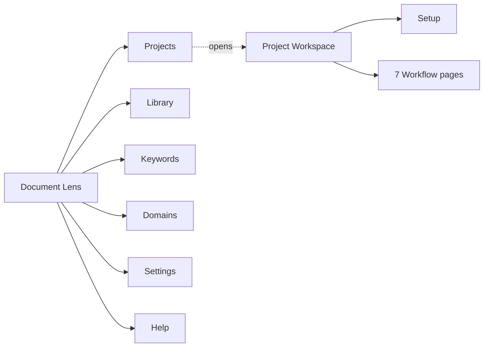
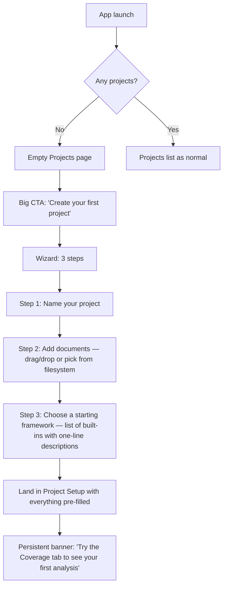

# Document Lens — Information Architecture

**Status:** DRAFT for review.
**Companion document:** [`user-stories.md`](./user-stories.md) (the
*what* and *why*; this doc is the *where* and *how*).

This document describes the proposed end-to-end information
architecture: the top-level navigation, the project workspace, the
per-workflow page layouts, and the cross-cutting UI elements. It
assumes a complete redesign is acceptable (no users, no breaking
changes to preserve).

---

## Goals

Drive every IA decision against these:

1. **A non-technical user can be productive in their first session
   without reading documentation.** Empty states, CTAs, and inline
   help carry the load that a manual would.
2. **Every page answers one plainly-worded question.** Page titles
   are user vocabulary ("Coverage", "Compare", "Track"), not engineer
   vocabulary ("Sentiment Analysis", "Embedding Mapping").
3. **The user always knows where they are and what they're looking
   at.** Project context (which docs, which keywords, which
   filters) is visible on every analysis page.
4. **The setup → analysis → export loop is short.** A user with one
   PDF and a built-in framework should reach a usable Coverage
   chart in under 60 seconds.
5. **Failure modes degrade gracefully.** Backend offline? Local
   features still navigable. No data yet? Every page tells the
   user what to do next.

---

## Top-level structure

Six top-level destinations. This is the entire global menu — no
hidden screens, no second-level navigation in the sidebar.



| Top-level page | Purpose | User vocabulary |
|---|---|---|
| **Projects** | List your studies. Open one to start analysing. | "What am I working on?" |
| **Library** | All your documents in one place. Import, edit attributes (year, company, sector), bulk-correct. | "What documents do I have?" |
| **Keywords** | Built-in frameworks + your custom keyword lists. Edit, copy, import from Excel. | "What am I looking for?" |
| **Domains** | Your domain lists (the lenses you use to view documents). Create, name, edit. | "What lenses do I use?" |
| **Settings** | Backend status, app preferences, data management. | "App config." |
| **Help** | In-app docs, tour, FAQ. | "Show me how." |

**Rationale for this shape:**
- *Projects is the default landing* (not Library) because the user's
  goal is *analysis*, not document management. Library is where they
  go when something specific needs fixing.
- *Keywords and Domains are peers, both global.* They're the two
  building blocks the user combines into a project. Treating them
  symmetrically in the menu reinforces that they play similar roles.
- *No "Visualizations" entry.* Visualisations belong inside the
  workflow that produces them, not as a separate top-level. (This
  collapses the existing /visualize page entirely — see Migration
  map.)
- *No "Analysis" entry.* "Analysis" is what the user does inside a
  project, not a destination.

---

## The Project workspace

When the user opens a project, they land in the **Project workspace**
— a focused environment with the project name pinned to the top and
seven workflow pages as tabs.

```
┌─────────────────────────────────────────────────────────────────┐
│ ← Projects   Acme 10-Year Sustainability                  [⋮]   │ ← Project bar
│ 23 documents · SDGs framework · ESG domains · 2014–2024         │ ← Context strip
├─────────────────────────────────────────────────────────────────┤
│ Setup │ Coverage │ Compare │ Track │ Discover │ Map │ Audit │ R │ ← Workflow tabs
├─────────────────────────────────────────────────────────────────┤
│                                                                 │
│ [Active workflow page renders here]                             │
│                                                                 │
└─────────────────────────────────────────────────────────────────┘
```

- **Project bar** — project name, back arrow to Projects list, and
  a `⋮` menu (Rename / Duplicate / Edit setup / Delete / Export
  bundle).
- **Context strip** — one-line summary of what's loaded into this
  project. Always visible. Updated when setup changes.
- **Workflow tabs** — eight tabs total: **Setup** (data assembly)
  + the seven analysis workflows. The order matters: Setup first
  (you can't analyse before assembling), then workflows roughly in
  the order a researcher would use them.

### Setup tab

The Setup tab is where the user assembles the project. Three
sections, top-to-bottom:

```
Setup
├─ Documents (23)        [+ Add documents from Library]
│  └─ Table: filename, year, company, status, [edit]
├─ Keywords              [+ Pick keyword list]
│  └─ Active list: SDGs (built-in)  [Customise — opens fork dialog]
└─ Domains               [+ Pick domain list]
   └─ Active list: ESG (Environmental, Social, Economic, Governance)
```

- **Documents section** lists the docs in this project (a subset of
  the Library). Inline year/company/sector edit (US-X-06). "+ Add"
  opens a Library picker so the user can multi-select.
- **Keywords section** shows the active keyword list. Picking from
  built-in opens a list picker; "Customise" forks the built-in into
  a custom copy and switches to the editor (US-X-01, US-D-07).
- **Domains section** shows the active domain list (one per
  project per US-E-02). Picking opens a domain-list picker; "+ New"
  inline-creates one.

If any section is empty, the corresponding workflow tabs are
disabled with a tooltip ("Add documents to enable Coverage"). The
user is never confronted with broken-looking workflows.

---

## The seven workflow pages

Every workflow page follows the same skeleton. This is non-negotiable
— consistency is what lets a non-technical user generalise from one
workflow to the next.

```
┌─────────────────────────────────────────────────────────────────┐
│ Coverage                                                        │ ← Page title (verb)
│ Which of your documents discuss this framework?                 │ ← Subtitle (the question)
├─────────────────────────────────────────────────────────────────┤
│ [Filters: Documents ▾] [Keywords ▾] [Tier ▾]   [Export ▾] [?]   │ ← Control bar
├─────────────────────────────────────────────────────────────────┤
│                                                                 │
│            [Primary visualisation — large, central]             │
│                                                                 │
├─────────────────────────────────────────────────────────────────┤
│ [Data table below — same data in tabular form, paginated]       │
└─────────────────────────────────────────────────────────────────┘
```

**Universal elements:**
- **Page title** is a *verb* (Coverage, Compare, Track, Discover…).
  Never a noun, never engineer terminology.
- **Subtitle** is the *question* the page answers, in plain
  English. Always present, always one sentence.
- **Control bar** is short and uses dropdowns/disclosures to hide
  complexity. The `?` is an inline help button that opens an explainer
  panel for this specific workflow.
- **Primary visualisation** dominates the page. Charts are sized
  generously; the table is supportive, not co-equal.
- **Data table below the chart** is collapsible. Mirrors the chart's
  data so users can copy/cite specific numbers. Always exportable.

### A. Coverage

> *Which of your documents discuss this framework?*

| Element | Detail |
|---|---|
| **Primary viz** | Document × keyword **heatmap**. Rows = documents, cols = keywords (or tier groups). Cell intensity = match count. |
| **Filters** | Documents (multi-select with "Select all"), Keywords (which subset of the active list), Tier (toggle: keywords / goals / pillars / etc., per the active list's hierarchy) |
| **Toggle** | "Include accepted synonyms" (US-A-04). On by default. Caption shows count: "matches include 8 accepted synonyms." |
| **Empty state** | "Run your first coverage check" + a one-click "Analyse all documents" CTA |
| **Export** | CSV, Excel, PNG (chart), shareable link (within bundle) |
| **Help panel** | Explains: "This shows which keywords appear in which documents. Darker = more mentions. Use the tier toggle to roll up to higher categories." |

Maps to: US-A-01, US-A-02, US-A-03, US-A-04.

### B. Compare

> *Which document does best on this framework?*

| Element | Detail |
|---|---|
| **Primary viz** | Horizontal **bar chart** ranking documents (or grouped by company / year / sector) by a single comparable metric. Default metric: framework completeness score (US-B-03). |
| **Filters** | Documents (multi-select), Group by (None / Company / Year / Sector — drives bar grouping), Metric (Completeness score / Total matches / Distinct keywords matched / Average matches per page) |
| **View toggle** | Single-framework comparison (default) vs. cross-framework comparison for one document (US-B-02, advanced — behind a toggle to keep the simple case simple) |
| **Empty state** | "Pick at least 2 documents to compare" + selector dialog |
| **Export** | CSV, Excel, PNG |
| **Help panel** | Explains the metric definitions in plain language, especially "completeness score" |

Maps to: US-B-01, US-B-02, US-B-03, US-B-04.

### C. Track

> *How has this topic changed over the years?*

| Element | Detail |
|---|---|
| **Primary viz** | **Trend line**, x-axis = year, y-axis = chosen measure. Multiple lines for overlay (US-C-03). |
| **Filters** | Topic (one keyword, one tier-group, or "all"), Group/overlay by (None / Company / Sector), Date range (slider on years) |
| **Measure toggle** | Match count / Coverage % / **Sentiment** (with caveat banner per principle #8) |
| **"Year unknown" call-out** | Always visible if any docs in scope have null year — "12 documents have no year and aren't shown on this chart. [Fix years →]" links to bulk year fix UI |
| **Empty state** | If <2 distinct years, "Need documents from at least 2 different years to show a trend. Add more documents or [fix missing years]." |
| **Export** | CSV, Excel, PNG |
| **Help panel** | Explains the measures, especially: *"Sentiment is a coarse approximate signal — useful for spotting changes in tone over time, not for absolute claims about a single document."* (principle #8 made concrete) |

Maps to: US-C-01, US-C-02, US-C-03, US-C-04.

### D. Discover

> *What words is your corpus using that you should know about?*

This page has two **sub-tabs** because it answers two related questions:

- **Phrases** (n-grams) — frequent 2-3 word phrases across the corpus
- **Synonyms** — corpus terms that are conceptually close to your
  existing keywords

| Element | Detail (Phrases sub-tab) |
|---|---|
| **Primary viz** | Ranked **table** with bar-chart visualisation of frequency. Each row: phrase, count, "+ Add to custom keyword list" button |
| **Filters** | N-gram size (2 / 3 / both), Documents, Min frequency |
| **Empty state** | "Run discovery" CTA |

| Element | Detail (Synonyms sub-tab) |
|---|---|
| **Primary viz** | Per-keyword cards. Each card: keyword name + table of candidate synonyms with corpus frequency + Accept / Reject buttons |
| **Mode** | Per-keyword (default — focused on one keyword at a time) OR Report mode (US-D-08 — shows all candidates across all keywords in one scrollable list) |
| **Outcome** | Accepted synonyms attach to the parent keyword (US-D-06). The keyword definition itself is unchanged (US-X-01 invariant preserved even for built-in frameworks). |
| **Help panel** | "Synonyms are corpus terms the model thinks are conceptually close to your keywords. Treat as suggestions — accept what makes sense, reject what doesn't. The model is approximate." |

Maps to: US-D-01 through US-D-08.

### E. Map

> *Which lenses does each document focus on?*

| Element | Detail |
|---|---|
| **Primary viz** | **Stacked bar** (one bar per document, segments = domains) for the per-document view; **pie/donut** for the project aggregate view. Toggle between the two. |
| **Filters** | Documents, Domain (highlight one domain across docs) |
| **Domain list selector** | Inline read-only ("Using domain list: ESG"). Click to change at the project level (jumps to Setup tab). |
| **Caveat banner** | *"Domain mapping uses semantic similarity — treat as an approximate hint, not a precise category assignment."* |
| **Empty state** | "Add a domain list in Setup to enable Map" |
| **Export** | CSV, Excel, PNG |

Maps to: US-E-01 through US-E-05.

### F. Audit

> *Are keywords appearing in sections where they don't belong?*

| Element | Detail |
|---|---|
| **Primary viz** | **Anomaly table**: keyword, document, section it appeared in, section it usually belongs in, surrounding 1-2 sentences (excerpt with "Show more") |
| **Filters** | Documents, Keywords (limit to a subset), Severity (sensitivity slider — fewer / more anomalies) |
| **Caveat banner** | *"Section assignments are inferred from document structure and may be approximate. Use the excerpt to verify each finding."* |
| **Empty state** | "Run audit" CTA. After run with no findings: "No structural anomalies found in this project." |
| **Export** | CSV (with excerpt column), Excel |
| **Help panel** | Explains the "where does this keyword usually belong" inference and how to interpret false positives |

Maps to: US-F-01, US-F-02.

### G. Read

> *What does each document actually say about a topic?*

| Element | Detail |
|---|---|
| **Primary viz** | **Concordance view**: keyword in context, one line per match, with surrounding 50 words. Each match expandable to show full paragraph. |
| **Filters** | Documents, Keyword (select one), Context window (50 / 100 / 250 words) |
| **Per-match action** | "Open in PDF" link — jumps to that page in the original document (US-G-02) |
| **Empty state** | "Pick a document and a keyword to read in context" |
| **Export** | CSV (concordance), Word doc (formatted for citation use) |

Maps to: US-G-01, US-G-02.

---

## The setup pages (Library, Keywords, Domains)

These are the global pages — they exist outside any project and feed
into projects.

### Library

```
Library
├─ Toolbar: [+ Import] [+ Bulk attributes from CSV] [Search] [Filter ▾]
├─ Table: Document, Year, Company, Sector, Used in N projects, Status, [edit]
└─ (selection toolbar appears when rows checked: Delete · Add to project · Re-extract)
```

- **Documents are global.** A document imported once can appear in
  many projects (US-X-08). The "Used in N projects" column makes
  this visible.
- **Bulk attributes from CSV** opens a dialog that accepts a CSV
  with `filename, year, company, sector` columns (US-X-07). Shows a
  preview of the matched documents and what will change before
  applying.
- **Year edit is inline** (per-row). Year is `number | null`; the
  cell shows "—" for null, and clicking it opens a small inline
  picker (US-X-06).

### Keywords

```
Keywords
├─ Toolbar: [+ New custom list] [+ Import from Excel/CSV]
├─ Sidebar: list grouped by [Built-in frameworks] / [My custom lists]
└─ Detail pane: selected list's keywords (with tier hierarchy if any),
   per-keyword on/off toggles, synonym sub-list per keyword
```

- **Built-in lists are toggle-only** for keyword text (US-X-01) but
  synonyms can still be added to their keywords (US-D-07 — synonyms
  are user metadata layered on top, not part of the framework
  definition).
- **Custom lists are fully editable** — add, rename, restructure into
  tiers, delete keywords; same synonym sub-list affordance per
  keyword.
- **Synonym sub-list** appears under each keyword as a small
  expandable section showing accepted synonyms and a button to open
  the Discover→Synonyms workflow scoped to that keyword.

### Domains

```
Domains
├─ Toolbar: [+ New domain list]
├─ Sidebar: list of domain lists by name
└─ Detail pane: selected list's domains (just names + descriptions),
   "Used in N projects" counter
```

Simpler than Keywords because domains are just names with optional
descriptions — no tiers, no synonyms, no extensive customisation.
The selection of *which* documents distribute across these domains
happens in workflow E (Map), not here.

---

## Cross-cutting UI elements

Components reused across many pages. Building these once and
applying consistently is what creates the "feels obvious" experience
for non-technical users.

### Project context strip

The strip below the project bar. Always shows:
> *N documents · {keyword list} · {domain list} · {year range}*

Click any of these segments to jump to the relevant section of Setup.
Updates live when setup changes.

### Filter bar

Standard control bar at the top of every workflow page. Always has:
- A **scope** indicator on the left (which subset of the project's
  data this view is using — typically Documents and Keywords)
- An **export** menu on the right
- A `?` help button at the far right

Filters use dropdowns with **clear "Select all / Select none"**
shortcuts. Filter state is part of the URL (so users can share or
bookmark a specific filtered view).

### Backend status indicator

Small chip in the top-right of the app shell. Three states:
- 🟢 Ready
- 🟡 Starting (spinner) — shown for the first ~10 seconds at app launch
- 🔴 Offline — clicking opens a panel with "what still works" list
  (per US-X-04)

### ML caveat banners

Inline yellow banner at the top of any workflow that uses an ML
signal (Track when sentiment selected, Map, Audit, Discover when
synonyms selected). Banner text is workflow-specific (see each
workflow's section). Dismissible per session (not per app run — if
the user closes and reopens the app, banners are back).

This implements design principle #8 directly. Make caveats
unmissable on first encounter, dismissable for return visits.

### Export menu

Same shape on every workflow page:
- **CSV** (raw data)
- **Excel** (formatted)
- **PNG** (the primary chart)
- **Bundle** (whole project — only available from project bar `⋮`
  menu, not per-workflow)

### Inline help panel

The `?` icon opens a side panel with workflow-specific help. Three
sections:
1. **What this answers** — restates the page's question
2. **How to read the chart** — annotated screenshot of a sample
3. **What to do next** — links to related workflows ("After Coverage,
   try Compare to rank documents")

---

## First-run experience

A new user opens the app. They have no projects, no documents, no
keyword lists they made themselves. What do they see?



Key points:
- The empty Projects page is the only place a wizard appears.
  Subsequent project creation is non-wizard (just a "+ New project"
  button + dialog) for users who now know what they're doing.
- The wizard has **defaults at every step** so the user can hit
  "Next" without making decisions if they're exploring.
- The "Try the Coverage tab" banner shows for the first project
  only and dismisses on first click.
- No domain list is required for the first project — the user can
  add one later when they discover Map. This avoids drowning a new
  user in concepts.

---

## Migration map: current pages → new structure

| Current page | New home | Notes |
|---|---|---|
| `/` (ProjectList) | **Projects** (top-level) | Same role, redesigned with wizard for empty state |
| `/project/:id` (ProjectDashboard) | **Project workspace → Setup tab** | Repurposed as project assembly, not a dashboard |
| `/project/:id/document/:docId` (DocumentView) | **Library → document detail** + **Workflow G (Read)** | Splits: editing/metadata goes to Library; concordance goes to Read |
| `/project/:id/search` (KeywordSearch) | **Workflow A (Coverage)** | Heatmap becomes primary viz; the existing table moves below |
| `/project/:id/ngrams` (NgramAnalysis) | **Workflow D (Discover) → Phrases sub-tab** | Same data, repositioned as "Discover what's in your corpus" |
| `/project/:id/visualize` (Visualizations) | **DELETE** | Splits across Workflows B (Compare), C (Track), and E (Map). The grab-bag pattern violates principle #1. |
| `/library` (DocumentLibrary) | **Library** (top-level) | Adds bulk-attribute CSV upload + inline year edit |
| `/keywords` (KeywordLists) | **Keywords** (top-level) | Adds synonym sub-lists per keyword |
| `/settings` (Settings) | **Settings** (top-level) | Largely unchanged |
| `/help` (Help) | **Help** (top-level) | Unchanged |

**Net new top-level page:** Domains.

**Net new sub-pages within Project workspace:** Compare, Track, Map,
Audit (Coverage / Discover / Read carry forward existing logic with
new layouts).

---

## Component inventory

What gets built once, used many places.

| Component | Used in |
|---|---|
| `ProjectBar` (project name + back + ⋮ menu) | Every workflow page |
| `ProjectContextStrip` | Every workflow page |
| `WorkflowTabs` | Project workspace shell |
| `FilterBar` (with scope + export + help slots) | All 7 workflow pages |
| `BackendStatusChip` | App shell |
| `MLCaveatBanner` | Track (when sentiment), Map, Audit, Discover/Synonyms |
| `ExportMenu` | Every workflow page |
| `HelpPanel` (slide-over) | Every workflow page |
| `EmptyState` (with CTA) | Workflow pages with no data, Projects/Library/Keywords/Domains |
| `DocumentPicker` (modal) | Setup tab, Compare's "Pick documents" button |
| `KeywordListPicker` (modal) | Setup tab |
| `DomainListPicker` (modal) | Setup tab |
| `InlineYearEditor` | Library table, Workflow C "Year unknown" callout |
| `BulkAttributeImport` (modal) | Library toolbar |
| `SynonymList` (per-keyword expandable) | Keywords detail pane, Workflow D Synonyms sub-tab |
| `Heatmap` | Workflow A |
| `RankBarChart` | Workflow B |
| `TrendLineChart` | Workflow C |
| `NgramTable` | Workflow D Phrases |
| `SynonymCard` | Workflow D Synonyms |
| `DomainStackedBar` / `DomainDonut` | Workflow E |
| `AnomalyTable` | Workflow F |
| `ConcordanceList` | Workflow G |

---

## Build order

A suggested phased implementation. Each phase ships independently
and leaves the app in a usable state.

**Phase 1 — Shell and infrastructure (no new analysis features):**
1. Top-level navigation: Projects, Library, Keywords, Domains
   (placeholder), Settings, Help
2. Project workspace shell with `ProjectBar` + `ProjectContextStrip`
   + `WorkflowTabs`
3. Setup tab implementing the new Documents / Keywords / Domains
   sections
4. `FilterBar`, `BackendStatusChip`, `MLCaveatBanner`,
   `ExportMenu`, `HelpPanel`, `EmptyState` components
5. Migrate existing data into the new project model (selected docs,
   keyword list reference, optional domain list reference)

**Phase 2 — Port existing analyses to new structure:**
6. Workflow A (Coverage): rebuild from current KeywordSearch with
   heatmap as primary viz
7. Workflow D Phrases sub-tab: port from current NgramAnalysis
8. Workflow G (Read): build concordance view, integrate with
   document page-link from current DocumentView
9. Delete the current Visualizations page (no longer needed)

**Phase 3 — New workflows that wire existing orphan endpoints:**
10. Domains top-level page (full CRUD for domain lists)
11. Workflow E (Map): wires `mapDomains`
12. Workflow F (Audit): wires `detectStructuralMismatch`

**Phase 4 — Net-new analyses:**
13. Workflow B (Compare)
14. Workflow C (Track) — including year-correction UX (US-X-06,
    US-X-07) and the "Year unknown" callout pattern
15. Workflow D Synonyms sub-tab (new backend endpoint for
    embedding-based synonym discovery)
16. Cross-keyword Synonym Discovery Report (US-D-08)

**Phase 5 — Polish:**
17. First-run wizard
18. ML caveat banners on every relevant workflow
19. Bundle export/import refactored for new project shape
20. Real test coverage (currently zero — the new shape gives us
    natural integration test boundaries)

---

## Open IA questions

These need decisions before Phase 1 starts.

1. **Tab vs sidebar for workflows.** I've drawn workflows as
   horizontal tabs across the top of the project workspace. An
   alternative is a left sidebar (more vertical screen space for
   each tab's content). Tabs match common research-tool patterns
   (Excel, Numbers, web browsers); sidebar is more like an IDE.
   Recommendation: **tabs**, because the user is consuming content
   horizontally (charts), not editing in tall list views.

2. **How prominent is "Setup" as a tab?** Drawn as the first
   tab. Alternative: hide it behind a "⚙ Setup" gear icon on the
   project bar, treating it as a configuration step rather than a
   peer of the workflows. Recommendation: **keep as first tab** —
   non-technical users need a clear "do this first" entry, and the
   tab self-disables further tabs until Setup is complete (creating
   a natural gate).

3. **Where do projects' analysis caches live?** Inside the
   project? In a global cache? This is a data-model question that
   affects whether re-opening a project is instant or shows a
   loading spinner. Recommendation: **inside the project**, with a
   "Re-analyse" button when underlying data has changed.

4. **Naming the Library.** "Library" is what I've used throughout,
   matching the existing UI. Alternatives: "Documents", "Sources",
   "Files". Recommendation: **keep Library** — it's already
   established, conveys the global/persistent meaning better than
   "Documents" (which sounds project-scoped).

5. **Should the synonym discovery report (US-D-08) be a sub-tab
   under Discover, or a top-level page?** Currently drawn as a
   sub-tab. A top-level page is more discoverable but adds menu
   complexity. Recommendation: **sub-tab** — it's a tool you reach
   for *during* a project, not in isolation.

6. **First-run wizard scope.** Three steps drawn. Alternative:
   skip the wizard entirely and let the empty state CTA drop the
   user straight into a new project's Setup tab with inline
   guidance. Recommendation: **wizard, but minimal** — the wizard
   sets expectations about what a "project" is; the alternative
   risks dropping the user into an unfamiliar Setup screen with no
   context.

7. **Read sub-tab on DocumentView vs standalone.** Currently drawn
   as workflow G inside the project. Alternative: make Read a
   per-document tab on the Library document-detail page (since
   reading is per-document, not per-project). Recommendation:
   **inside the project workflow** — Read is bounded by the
   project's keyword set, so it lives where the keywords live.

---

## What this IA explicitly does NOT do

To prevent scope creep and to make the design contract clear:

- **No real-time collaboration.** Single-user app. Sharing happens
  via `.lens` bundle export.
- **No project version history / undo across sessions.** Bundle
  export is the recovery story.
- **No multi-project comparison.** Each project is self-contained.
  If users want cross-project analysis, they can clone projects to
  share documents.
- **No custom-built chart types beyond the ones listed.** Each
  workflow has *one* primary visualisation. We don't ship a
  "build your own dashboard" surface.
- **No in-app keyword-list marketplace / sharing service.** Keyword
  list import is via Excel/CSV file; we don't run a hosted catalogue.
- **No automatic year detection from PDF *content*.** Year detection
  is filename-only by default. Users correct missing years manually
  or via CSV bulk upload (US-X-07).
- **No annotation / highlighting of PDFs.** The PDF is a source;
  the app's affordances are at the metadata layer.

If a future need pushes for any of the above, it's a scope-expansion
conversation, not a "we forgot it" oversight.
