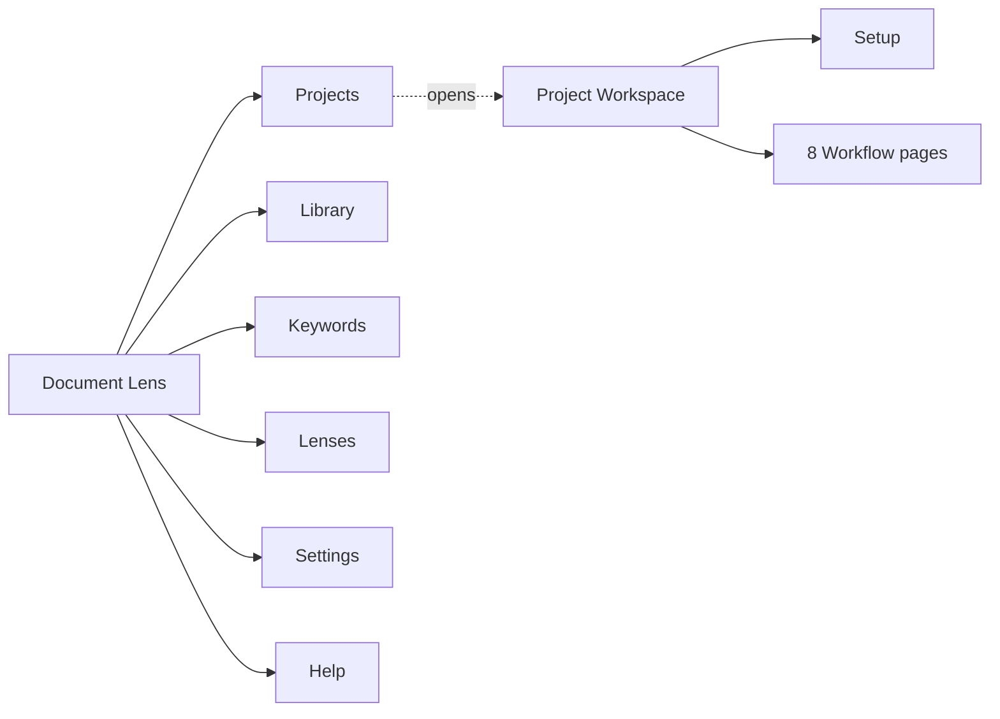
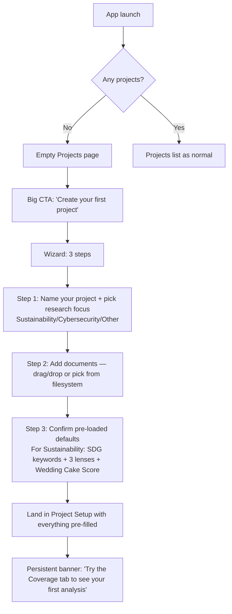

# Document Lens — Information Architecture

**Status:** v2 (DRAFT for review).
**Companion document:** [`user-stories.md`](./user-stories.md) (the
*what* and *why*; this doc is the *where* and *how*).

This document describes the proposed end-to-end information
architecture: top-level navigation, the project workspace, per-workflow
page layouts, and cross-cutting UI elements. It assumes a complete
redesign is acceptable (no users, no breaking changes to preserve).

**v2 changes from v1** (driven by the methodology source materials —
methodology DOCX, Universities keyword XLSX, Wedding Cake PDF):
- Top-level "Domains" page renamed to **"Lenses"** to cover both
  keyword-attached axes (e.g., SDG) and document-context axes
  (e.g., Function)
- Workflow tabs grow from 7 to **8** with the addition of **H. Score**
- Workflow **E. Map** is reframed: primary viz is now a 2D
  cross-tabulation matrix when two axes are selected
- Setup tab grows from 3 to **4 sections** (adds Scoring rule)
- Build order revised: Track and Score move earlier; they produce the
  actual paper deliverable
- First-run experience explicitly seeds the project with the SDG
  defaults (per principle #9)

---

## Goals

Drive every IA decision against these:

1. **A non-technical user can be productive in their first session
   without reading documentation.** Empty states, CTAs, inline help,
   and pre-loaded sustainability defaults carry the load that a manual
   would.
2. **Every page answers one plainly-worded question.** Page titles
   are user vocabulary ("Coverage", "Compare", "Track", "Score"),
   not engineer vocabulary.
3. **The user always knows where they are and what they're looking
   at.** Project context (which docs, which keywords, which lenses,
   which scoring rule, which filters) is visible on every analysis
   page.
4. **The setup → analysis → export loop is short.** A sustainability
   researcher with one PDF should reach a usable Coverage chart and a
   Score in under 60 seconds, with the SDG defaults doing the work.
5. **Failure modes degrade gracefully.** Backend offline? Local
   features still navigable. No data yet? Every page tells the user
   what to do next.

---

## Top-level structure

Six top-level destinations. This is the entire global menu — no
hidden screens, no second-level navigation in the sidebar.



| Top-level page | Purpose | User vocabulary |
|---|---|---|
| **Projects** | List your studies. Open one to start analysing. | "What am I working on?" |
| **Library** | All your documents in one place. Import, edit attributes (year, company, sector), bulk-correct. | "What documents do I have?" |
| **Keywords** | Built-in frameworks (with positive + counter keywords) and your custom keyword lists. Edit, copy, import from Excel. Each keyword list declares the Lenses its keywords carry tags for. | "What am I looking for?" |
| **Lenses** | Tag axes — the dimensions you classify keyword mentions along. Built-in lenses: SDG, Wedding Cake Pillar (derives from SDG), Function (Teaching/Research/Engagement/Operations, classified per section by embedding similarity — deterministic, batch-friendly). Custom lenses for non-sustainability work. | "What lenses do I view through?" |
| **Settings** | Backend status, app preferences, scoring rule editor, data management. | "App config." |
| **Help** | In-app docs, tour, FAQ. | "Show me how." |

**Why "Lenses" not "Domains" or "Tag Axes":**
- "Domains" was misleading — implied a single classification scheme
- "Tag Axes" is engineer vocabulary (violates principle #2)
- "Lenses" matches the app's name (*Document Lens*) and the
  user's own framing of the concept, and conveys "a way of looking
  at the same document"

**Why Scoring Rules live under Settings, not as a top-level page:**
- Most users will never touch them — they'll use the default 5-level
  Wedding Cake Score
- Custom rule definition is a rare, advanced action
- The active scoring rule for a project is configured in the
  project's Setup tab, where the per-project context belongs

---

## The Project workspace

When the user opens a project, they land in the **Project workspace**
— a focused environment with the project name pinned to the top and
nine tabs (Setup + 8 workflows).

```
┌─────────────────────────────────────────────────────────────────┐
│ ← Projects   Acme 10-Year Sustainability                  [⋮]   │ ← Project bar
│ 23 docs · SDG keywords · SDG/Pillar/Function lenses · Wedding  │
│ Cake Score · 2014–2024                                          │ ← Context strip
├─────────────────────────────────────────────────────────────────┤
│ Setup │ Coverage │ Map │ Score │ Track │ Compare │ Audit │ Disc │ Read │
├─────────────────────────────────────────────────────────────────┤
│                                                                 │
│ [Active workflow page renders here]                             │
│                                                                 │
└─────────────────────────────────────────────────────────────────┘
```

- **Project bar** — project name, back arrow to Projects list, and
  a `⋮` menu (Rename / Duplicate / Edit setup / Delete / Export
  bundle).
- **Context strip** — one-line summary of what's loaded into this
  project: docs · keyword list · active lenses · scoring rule · year
  range. Always visible. Updated when setup changes.
- **Workflow tabs** — nine tabs. **Setup** first (assembly), then
  workflows roughly in the order a researcher would use them:
  - **Coverage** — what keywords appear where
  - **Map** — distribution / cross-tabulation across lenses
  - **Score** — the rubric output (default: 5-level Wedding Cake)
  - **Track** — change over time (the headline deliverable)
  - **Compare** — rank documents
  - **Audit** — context verification (both confirmation and mismatch)
  - **Discover** — extend keyword and counter-keyword lists
  - **Read** — concordance

  Workflow tabs disable themselves when prerequisites are missing
  (e.g., Track needs ≥2 distinct years; Score needs an active
  scoring rule).

### Setup tab

The Setup tab is where the user assembles the project. Four sections,
top-to-bottom:

```
Setup
├─ Documents (23)            [+ Add documents from Library]
│  └─ Table: filename, year, company, status, [edit]
├─ Keywords                  [+ Pick keyword list]
│  └─ Active list: SDGs (built-in)  [Customise — opens fork dialog]
│      Counter-keywords: 67 entries (Non-SDG sheet) — included by default
├─ Lenses                    [+ Add lens]
│  └─ Active lenses:
│      • SDG (keyword-attached, from SDG list)
│      • Pillar (derived from SDG)
│      • Function (embedding-classified per section — Teaching/Research/Engagement/Operations)
└─ Scoring rule              [Change]
   └─ Active rule: 5-level Wedding Cake Score (default)
```

- **Documents section** lists the docs in this project (a subset of
  the Library). Inline year/company/sector edit (US-X-06). "+ Add"
  opens a Library picker.
- **Keywords section** shows the active keyword list. Picking from
  built-in opens a list picker; "Customise" forks the built-in into
  a custom copy and switches to the editor (US-X-01, US-D-07).
  Counter-keywords live inside the same list (US-X-11) — a
  collapsible "Counter-keywords" subsection in the editor.
- **Lenses section** lets the user add/remove tag axes. Default for
  a new sustainability project: SDG + Pillar + Function (US-X-13).
  For non-sustainability work, the user picks from the global Lenses
  catalogue or defines new ones.
- **Scoring rule section** shows the active rule. Default for SDG
  projects: 5-level Wedding Cake Score (US-H-05). "Change" opens a
  picker; "+ Define new rule" opens the rule editor in Settings.

If any required section is empty, the corresponding workflow tabs
are disabled with a tooltip ("Add documents to enable Coverage").
The user is never confronted with broken-looking workflows.

---

## The eight workflow pages

Every workflow page follows the same skeleton. This is non-negotiable
— consistency is what lets a non-technical user generalise from one
workflow to the next.

```
┌─────────────────────────────────────────────────────────────────┐
│ Coverage                                                        │ ← Page title (verb)
│ Which of your documents discuss this framework?                 │ ← Subtitle (the question)
├─────────────────────────────────────────────────────────────────┤
│ [Filters: Documents ▾] [Polarity ▾] [Lens ▾]   [Export ▾] [?]   │ ← Control bar
├─────────────────────────────────────────────────────────────────┤
│                                                                 │
│            [Primary visualisation — large, central]             │
│                                                                 │
├─────────────────────────────────────────────────────────────────┤
│ [Data table below — same data in tabular form, paginated]       │
└─────────────────────────────────────────────────────────────────┘
```

**Universal elements:**
- **Page title** is a *verb* (Coverage, Map, Score, Track…).
  Never a noun, never engineer terminology.
- **Subtitle** is the *question* the page answers, in plain English.
- **Control bar** is short and uses dropdowns to hide complexity.
  The `?` is an inline help button that opens a side panel.
- **Primary visualisation** dominates the page.
- **Data table below the chart** is collapsible. Always exportable.

### A. Coverage

> *Which of your documents discuss this framework?*

| Element | Detail |
|---|---|
| **Primary viz** | Document × keyword (or × tag value) **heatmap**. Cell intensity = match count. |
| **Filters** | Documents, **Polarity** (Positive / Counter / Both — default Both renders the two heatmaps stacked, one above the other, each with its own colour scale; see IA-3), **Lens** (which axis to use as columns — Keyword / SDG / Pillar / Function), **Tier** (when the chosen lens is hierarchical, roll up to parent level) |
| **Toggle** | "Include accepted synonyms" (US-A-04). On by default. Caption shows count. |
| **Empty state** | "Run your first coverage check" + a one-click "Analyse all documents" CTA |
| **Export** | CSV, Excel, PNG, shareable bundle |
| **Help panel** | Explains: "Darker = more mentions. Use Polarity to separate positive matches (topic IS being delivered) from counter matches (topic is being undermined or performatively framed). Use the Lens to switch between keyword-level detail and roll-ups by SDG/Pillar/Function." |

Maps to: US-A-01 through US-A-06.

### E. Map

> *Where in this document does each topic appear, and how do topics overlap?*

This is the workflow that produces the **SDG × Function cross-tab**
the methodology document calls for, and generalises to any pair of
active lenses.

| Element | Detail |
|---|---|
| **Mode toggle** | **One-axis** (per-document distribution) vs **Two-axis** (cross-tabulation matrix). Default is Two-axis when ≥2 lenses are active in the project. |
| **Primary viz (one-axis mode)** | **Stacked bar** (one bar per document, segments = lens values) for per-document view; **donut** for project aggregate. |
| **Primary viz (two-axis mode)** | **2D matrix heatmap** for one selected document — rows = values of axis 1 (e.g., SDG), columns = values of axis 2 (e.g., Function), cells = match count or coverage %. View toggle between per-document and project-aggregate. |
| **Filters** | Documents, Lens-1 (rows), Lens-2 (cols, only in two-axis mode), Polarity (Positive / Counter / Both), Highlight one value across the matrix |
| **Caveat banner** | *"Lens classifications use semantic similarity (sentence embeddings). Same model gives the same answer every time, but the model is approximate — treat as a strong signal, not a precise category assignment."* |
| **Empty state** | "Add at least one Lens in Setup to enable Map" |
| **Export** | CSV (long-form table), Excel (matrix), PNG |
| **Help panel** | Explains the difference between keyword-attached and context-inferred lenses; how to interpret the 2D matrix |

Maps to: US-E-01 through US-E-05.

### H. Score (NEW)

> *How does this document rate on my chosen rubric?*

| Element | Detail |
|---|---|
| **Primary viz (per document)** | Big-type level indicator (e.g., "Level 3 of 4") with a one-sentence description of what that level means, plus the underlying matrix that drove the score (so the score is auditable, not a black box) |
| **Primary viz (project aggregate)** | **Histogram** of score values across all documents in the project (e.g., "5 docs at L0, 8 at L1, 7 at L2, 3 at L3, 0 at L4") |
| **Mode toggle** | Per-document (default — focused on one document at a time, picker for which) vs. Project distribution (aggregate) |
| **Scoring rule selector** | Inline read-only ("Using rule: 5-level Wedding Cake Score"). Click to change at the project level (jumps to Setup tab). |
| **"Why this score" panel** | Always visible below the level indicator. Shows the rule's evaluation steps in plain language: "Functions delivering Economy + Society + Biosphere SDGs simultaneously: Teaching ✓, Research ✓, Engagement ✗, Operations ✗ → 2 of 4 → Level 2" |
| **Caveat banner** | *"Scores are computed from keyword matches and lens classifications. They reflect what the document says, not what the organisation actually does. Treat as a content-disclosure metric."* |
| **Filters** | Documents, Polarity (compute score on positives only / include counters as negatives) |
| **Empty state** | If no scoring rule active: "Pick a scoring rule in Setup. The default is the 5-level Wedding Cake Score for sustainability projects." |
| **Export** | CSV (per-doc scores), PNG (level indicator + matrix), paper-ready bundle (chart + methodology blurb + data) |
| **Help panel** | Explains what the active rule computes; links to the rule definition for users who want to inspect or customise |

Maps to: US-H-01 through US-H-05.

### C. Track

> *How has this topic changed over the years?*

> *This is the headline deliverable workflow. The paper output the
> sustainability research team is producing comes from here.*

| Element | Detail |
|---|---|
| **Primary viz** | **Trend line**, x-axis = year, y-axis = chosen measure. Multiple lines for overlay (US-C-03, US-C-05). |
| **Filters** | Topic (one keyword / lens value / "all"), Group/overlay by (None / Company / Sector / Polarity for the positive-vs-counter view), Date range slider |
| **Measure toggle** | Match count / Coverage % / **Score** (uses the project's active scoring rule per year) / Sentiment (with caveat) |
| **Polarity overlay** | Toggle to overlay the counter-keyword trend on the same chart in a contrasting colour (US-C-05). Explanation: "Counter-keywords signal greenwashing or performative language. Watch for divergence — positive going up while counter also goes up may indicate more reporting *but more questionable framing*." |
| **"Year unknown" call-out** | Always visible if any docs in scope have null year — "12 documents have no year and aren't shown on this chart. [Fix years →]" |
| **Empty state** | If <2 distinct years, "Need documents from at least 2 different years. [Add documents] or [fix missing years]." |
| **Export** | CSV, Excel, PNG, **paper-ready bundle** (US-C-07: chart PNG + methodology blurb naming the framework, scoring rule, filters, document set, date range + underlying data CSV — drop directly into a paper) |
| **Help panel** | Explains the measures, including the polarity overlay interpretation and the sentiment caveat |

Maps to: US-C-01 through US-C-07.

### B. Compare

> *Which document does best on this framework?*

| Element | Detail |
|---|---|
| **Primary viz** | Horizontal **bar chart** ranking documents (or grouped by company / year / sector) by a single comparable metric. |
| **Metric toggle** | **Scoring rule output** (default — uses the project's active rule, e.g., the 5-level Wedding Cake Score) / Total positive matches / Distinct keywords matched / Positive-minus-counter / Average matches per page (US-B-05) |
| **Filters** | Documents (multi-select), Group by (None / Company / Year / Sector — drives bar grouping), Polarity |
| **View toggle** | Single-framework comparison (default) vs. cross-framework comparison for one document (US-B-02, advanced — behind a toggle) |
| **Empty state** | "Pick at least 2 documents to compare" + selector dialog |
| **Export** | CSV, Excel, PNG |
| **Help panel** | Explains each metric definition, especially "Scoring rule output" and how the active rule contributes |

Maps to: US-B-01 through US-B-05.

### F. Audit

> *Is each keyword being used in the right context?*

| Element | Detail |
|---|---|
| **Mode toggle** | **Anomalies** (default — keywords in unexpected sections) vs **Confirmations** (keywords whose context aligns with framework intent — the methodology's contextual relevance check, US-F-03) |
| **Primary viz (anomalies)** | Anomaly table: keyword, document, section it appeared in, section it usually belongs in, surrounding 1-2 sentences |
| **Primary viz (confirmations)** | Confirmation table: keyword, document, section, framework intent it confirms, snippet — useful to defend the analysis to a sceptical reviewer |
| **Filters** | Documents, Keywords subset, Severity (sensitivity slider), Polarity |
| **Caveat banner** | *"Section assignments are inferred from document structure. Use the excerpt to verify each finding."* |
| **Empty state** | "Run audit" CTA. After run with no findings (anomalies): "No structural anomalies found in this project." |
| **Export** | CSV (with excerpt column), Excel |
| **Help panel** | Explains both modes and how to interpret false positives |

Maps to: US-F-01, US-F-02, US-F-03.

### D. Discover

> *What words is your corpus using that you should know about?*

Two **sub-tabs**:

- **Phrases** (n-grams) — frequent 2-3 word phrases across the corpus
- **Synonyms** — corpus terms conceptually close to your existing
  keywords; **separate sub-modes for positive synonyms vs counter
  synonyms** (US-D-09)

| Element | Detail (Phrases sub-tab) |
|---|---|
| **Primary viz** | Ranked **table** with bar-chart visualisation of frequency. Each row: phrase, count, "+ Add to keyword list" button |
| **Filters** | N-gram size (2 / 3 / both), Documents, Min frequency |
| **Empty state** | "Run discovery" CTA |

| Element | Detail (Synonyms sub-tab) |
|---|---|
| **Polarity selector** | Positive synonyms (default) vs. **Counter synonyms** (terms close to known counter-keywords — US-D-09). Important to keep separate so users don't accidentally promote a counter-synonym into the positive list. |
| **Primary viz** | Per-keyword cards. Each card: keyword name (with polarity tag) + table of candidate synonyms with corpus frequency + Accept / Reject buttons |
| **Mode** | Per-keyword (focused) OR Report mode (US-D-08 — all candidates across all keywords in one scrollable list) |
| **Outcome** | Accepted synonyms attach to the parent keyword (US-D-06), preserving the keyword's polarity. The framework definition itself stays unchanged (US-X-01 invariant preserved for built-in frameworks). |
| **Help panel** | "Synonyms are corpus terms the model thinks are conceptually close to your keywords. Treat as suggestions — accept what makes sense, reject what doesn't. The model is approximate. **Counter-synonyms** are terms close to your known counter-keywords (e.g., new ways of describing carbon-offset reliance) — promoting them keeps your counter-list current with how greenwashing language evolves." |

Maps to: US-D-01 through US-D-09.

### G. Read

> *What does each document actually say about a topic?*

| Element | Detail |
|---|---|
| **Primary viz** | **Concordance view**: keyword in context, one line per match, with surrounding 50 words. Each match expandable. |
| **Filters** | Documents, Keyword (select one), Context window (50 / 100 / 250 words), Polarity |
| **Per-match action** | "Open in PDF" link (US-G-02) |
| **Empty state** | "Pick a document and a keyword to read in context" |
| **Export** | CSV (concordance), Word doc (formatted for citation use) |

Maps to: US-G-01, US-G-02.

---

## The setup pages (Library, Keywords, Lenses, Scoring rules)

These are the global pages — they exist outside any project and feed
into projects.

### Library

```
Library
├─ Toolbar: [+ Import] [+ Bulk attributes from CSV] [Search] [Filter ▾]
├─ Table: Document, Year, Company, Sector, Used in N projects, Status, [edit]
└─ (selection toolbar appears when rows checked: Delete · Add to project · Re-extract)
```

Documents are global (US-X-08). Bulk attributes from CSV (US-X-07).
Inline year edit per row (US-X-06). Year is `number | null`; null
shows as "—".

### Keywords

```
Keywords
├─ Toolbar: [+ New custom list] [+ Import from Excel/CSV]
├─ Sidebar: list grouped by [Built-in frameworks] / [My custom lists]
└─ Detail pane:
   ├─ List metadata: name, description, declared lenses
   ├─ Keywords (positive) — table with per-keyword on/off toggle and synonym sub-list
   └─ Counter-keywords (collapsible section) — same table shape, polarity flag = counter
```

- Built-in lists are toggle-only for keyword text (US-X-01).
- Synonyms can be added to both built-in and custom keywords (US-D-07).
- Counter-keywords live inside the same list as positives (US-X-11),
  shown in a collapsible subsection so they don't clutter the
  primary view but are always one click away.
- The list's **declared lenses** (e.g., "this list carries SDG and
  Pillar tag values per keyword") are visible at the top of the
  detail pane. New lists declare their lenses on creation.

### Lenses

```
Lenses
├─ Toolbar: [+ New lens]
├─ Sidebar: list grouped by [Keyword-attached] / [Document-context]
└─ Detail pane:
   ├─ Lens metadata: name, description, type (keyword-attached or context),
   │  source (which keyword list it comes from, or which inference model)
   ├─ Values — list of the discrete values this lens admits, with optional
   │  hierarchy (e.g., Pillar → SDG)
   └─ "Used in N projects" counter
```

Built-in lenses pre-loaded for sustainability work:
- **SDG** (keyword-attached, from SDG keyword list) — values 1–17
- **Pillar** (keyword-attached, derived from SDG) — values
  Biosphere / Society / Economy / Partnership
- **Function** (document-context, classified per section via
  embedding similarity to function descriptions) — values
  Teaching / Research / Engagement / Operations. Deterministic
  (same model, same answer every run). Batch-friendly (no
  per-document API cost). Wires to document-analyser's
  `mapDomains` endpoint.

User-defined lenses for non-sustainability work (e.g., a "NIST CSF
Function" lens with values Identify / Protect / Detect / Respond /
Recover).

---

## Cross-cutting UI elements

Components reused across many pages. Building these once and
applying consistently is what creates the "feels obvious" experience
for non-technical users.

### Project context strip

The strip below the project bar. Always shows:
> *N documents · {keyword list} · {N active lenses} · {scoring rule} · {year range}*

Click any segment to jump to the relevant section of Setup. Updates
live when setup changes.

### Filter bar

Standard control bar at the top of every workflow page. Always has:
- A **scope** indicator on the left (which subset of the project's
  data this view is using)
- An **export** menu on the right
- A `?` help button at the far right

Filters use dropdowns with **clear "Select all / Select none"**
shortcuts. Filter state is part of the URL (so users can share or
bookmark a specific filtered view).

### Backend status indicator

Small chip in the top-right of the app shell. Three states:
- 🟢 Ready
- 🟡 Starting (spinner)
- 🔴 Offline — clicking opens a panel with "what still works" list (US-X-04)

### ML caveat banners

Inline yellow banner at the top of any workflow that uses an ML
signal:
- **Map** — semantic similarity (sentence embeddings) for both
  keyword-attached and context lenses. Deterministic per model
  version, but the model is approximate.
- **Score** — the scoring rule reflects what the document *says*, not
  what the organisation *does* (a content-disclosure caveat)
- **Audit** — section-assignment inference is approximate
- **Discover/Synonyms** — model approximation
- **Track** when sentiment selected — coarse-signal warning

Banner text is workflow-specific. Dismissible per session, not per
app run.

### Polarity-aware controls

Wherever keywords are filtered or counted, a **Polarity** dropdown is
present (Positive / Counter / Both). Defaults vary per workflow:
- Coverage: Both (stacked panels, separate colour scales — see IA-3)
- Map: Positive (with explicit toggle to add counter as overlay)
- Score: Positive (counter contributes only via the scoring rule
  if the rule explicitly references it)
- Track: Both (positive-vs-counter overlay is one of the most
  important Track visualisations per US-C-05)
- Audit: Both
- Discover/Synonyms: Polarity-of-target-keyword (sub-mode picker)

### Export menu

Same shape on every workflow page:
- **CSV** (raw data)
- **Excel** (formatted)
- **PNG** (the primary chart)
- **Paper-ready bundle** (Track and Score only — chart + methodology
  blurb + data; US-C-07, US-H-04)
- **Project bundle** (whole project — only from project bar `⋮`)

### Inline help panel

The `?` icon opens a side panel with workflow-specific help. Three
sections:
1. **What this answers** — restates the page's question
2. **How to read the chart** — annotated screenshot
3. **What to do next** — links to related workflows

---

## First-run experience

A new user opens the app. They have no projects, no documents, no
custom keyword lists. What do they see?



Key points:
- **Sustainability is the first listed focus** in Step 1 because
  it's the validated use case and ships with the most defaults.
  Cybersecurity and Other are placeholders for the
  generalisation work.
- The wizard has **defaults at every step**. For Sustainability,
  Step 3 shows the pre-loaded SDG keyword list, three lenses (SDG,
  Pillar, Function), and the Wedding Cake Score with a brief
  description of each — the user just clicks "Use defaults".
- Subsequent project creation is non-wizard (just a "+ New project"
  button + dialog) — wizard is empty-state-only.
- **Wizard remains opt-in for repeat use**: the "+ New project"
  dialog includes a small "[Use guided setup]" link that re-runs
  the wizard for users who want it. Also accessible via Help menu
  ("Run new-project setup wizard"). Discoverable but not in the
  way of fast project creation.
- The "Try the Coverage tab" banner shows for the first project
  only and dismisses on first click.

---

## Migration map: current pages → new structure

| Current page | New home | Notes |
|---|---|---|
| `/` (ProjectList) | **Projects** (top-level) | Same role, redesigned with wizard for empty state |
| `/project/:id` (ProjectDashboard) | **Project workspace → Setup tab** | Now four sections (Documents, Keywords, Lenses, Scoring rule) |
| `/project/:id/document/:docId` (DocumentView) | **Library → document detail** + **Workflow G (Read)** | Splits |
| `/project/:id/search` (KeywordSearch) | **Workflow A (Coverage)** | Heatmap as primary viz |
| `/project/:id/ngrams` (NgramAnalysis) | **Workflow D (Discover) → Phrases sub-tab** | |
| `/project/:id/visualize` (Visualizations) | **DELETE** | Splits across Compare, Track, Map (per principle #1) |
| `/library` (DocumentLibrary) | **Library** (top-level) | Adds bulk-attribute CSV upload + inline year edit |
| `/keywords` (KeywordLists) | **Keywords** (top-level) | Adds counter-keyword section + per-keyword synonym sub-lists + lens declarations |
| `/settings` (Settings) | **Settings** (top-level) | Adds scoring rule editor |
| `/help` (Help) | **Help** (top-level) | Unchanged |

**Net new top-level page:** Lenses.

**Net new project sub-pages:** Map, Score, Track, Compare, Audit
(Coverage / Discover / Read carry forward existing logic with new
layouts).

---

## Component inventory

| Component | Used in |
|---|---|
| `ProjectBar` | Every workflow page |
| `ProjectContextStrip` | Every workflow page |
| `WorkflowTabs` | Project workspace shell |
| `FilterBar` (with scope + polarity + export + help slots) | All 8 workflow pages |
| `BackendStatusChip` | App shell |
| `MLCaveatBanner` | Map, Score, Audit, Discover/Synonyms, Track (when sentiment) |
| `PolaritySelector` | All workflows that filter/count keywords |
| `ExportMenu` (with paper-ready option for Track/Score) | Every workflow page |
| `HelpPanel` (slide-over) | Every workflow page |
| `EmptyState` (with CTA) | Workflow pages with no data, all global pages |
| `DocumentPicker` (modal) | Setup tab, Compare's "Pick documents" |
| `KeywordListPicker` (modal) | Setup tab |
| `LensPicker` (modal) | Setup tab |
| `ScoringRulePicker` (modal) | Setup tab, Score header |
| `InlineYearEditor` | Library table, Track "Year unknown" callout |
| `BulkAttributeImport` (modal) | Library toolbar |
| `SynonymList` (per-keyword expandable) | Keywords detail pane, Discover Synonyms sub-tab |
| `Heatmap` | Coverage |
| `MatrixHeatmap` (2D, with row/col labels and cell tooltips) | Map (two-axis mode) |
| `RankBarChart` | Compare |
| `TrendLineChart` (with polarity overlay support) | Track |
| `LevelIndicator` (big-type score with description) | Score (per-document) |
| `ScoreHistogram` | Score (project-aggregate) |
| `WhyThisScorePanel` | Score (the rule's evaluation steps in plain language) |
| `NgramTable` | Discover Phrases |
| `SynonymCard` | Discover Synonyms |
| `LensDistributionChart` (stacked bar / donut) | Map (one-axis mode) |
| `AnomalyTable` / `ConfirmationTable` | Audit |
| `ConcordanceList` | Read |
| `RuleEditor` | Settings (scoring rule definition) |

---

## Build order

Revised from v1: **Track and Score move earlier** because they
produce the actual paper deliverable (resolved decision 9). The new
data model (polarity, multi-axis tags, scoring rules) is also
foundational so it lands in Phase 1 alongside the shell.

**Phase 1 — Shell, data model, infrastructure:**
1. Top-level navigation: Projects, Library, Keywords, Lenses,
   Settings, Help
2. Project workspace shell (ProjectBar + ProjectContextStrip +
   WorkflowTabs)
3. Setup tab with all four sections (Documents, Keywords, Lenses,
   Scoring rule)
4. **New SQLite schema** with polarity flag, tag axes, scoring
   rules tables. Old tables stay in place but are superseded.
5. Pre-load sustainability defaults: SDG keyword list (positive +
   counter), Pillar lens, Function lens, Wedding Cake Score.
6. Cross-cutting components: FilterBar, PolaritySelector,
   BackendStatusChip, MLCaveatBanner, ExportMenu, HelpPanel,
   EmptyState

**Phase 2 — Coverage and Read (port existing analyses):**
7. Workflow A (Coverage) with polarity filter and lens-axis filter
8. Workflow D Phrases sub-tab (port n-grams)
9. Workflow G (Read) — concordance view

**Phase 3 — Map and Score (the new model lights up):**
10. Lenses top-level page (full CRUD)
11. Workflow E (Map) — one-axis mode, then two-axis matrix
12. Scoring rule entity + RuleEditor in Settings
13. Workflow H (Score) with the 5-level Wedding Cake Score
    pre-applied

**Phase 4 — Track (the headline deliverable):**
14. Workflow C (Track) including:
    - Year-correction UX (US-X-06, US-X-07)
    - "Year unknown" callout
    - Positive-vs-counter polarity overlay (US-C-05)
    - **Paper-ready bundle export** (US-C-07)

**Phase 5 — Compare, Audit, Discover/Synonyms:**
15. Workflow B (Compare) with Scoring rule as default metric
16. Workflow F (Audit) with both Anomalies and Confirmations modes
17. Workflow D Synonyms sub-tab + counter-synonym mode (US-D-09)

**Phase 6 — Polish:**
18. First-run wizard with focus picker (Sustainability default)
19. Bundle export/import refactored for new project shape
20. Real test coverage (currently zero)
21. Delete the now-unused `/visualize` page and its components
22. README rewrite (currently has stale Python-microservice content)

---

## Resolved IA decisions

All seven open IA questions resolved 2026-05-11. Recorded here so
future contributors can see why each decision was made.

### IA-1. Function lens inference uses sentence embeddings (not LLM, not section headings)

**Decision:** Embedding-based semantic classification per section.
Wires to document-analyser's existing `mapDomains` endpoint.

For each section in a document: embed the section text, compare to
embeddings of the four Function descriptions, assign the section to
its closest function (or top-N if multi-function). Apply the function
tag to all keyword mentions in that section.

**Why:** the user explicitly raised determinism + batch scale
concerns. Embeddings give same answer every run (per model version),
no per-call cost, fast at corpus scale. Section-heading inference
would be brittle on the 50+ varying-format annual reports the
researchers analyse. LLMs are non-deterministic and have cost +
latency at batch scale.

LLM-based inference can be added later as an *optional* upgrade for
users who want richer reasoning per section, but embeddings are the
right default.

### IA-2. Scoring rule editor is form-based, with configurable level count

**Decision:** Form-based UI for v1. Drop-downs and pickers; no
syntax. Editor explicitly asks the user how many output levels their
rule produces and lets them label each level (numeric like 0–4, or
text like Bronze/Silver/Gold).

The 5-level Wedding Cake Score is one *example* shape — the editor
supports rules with any number of levels, any labels, any combining
logic. Tag-axis values (e.g., Pillar count) are equally configurable
when defining a custom Lens.

If users hit form-UI ceilings later, a DSL escape hatch can ship in
a future version.

### IA-3. ~~Counter-keyword display uses side-by-side small heatmaps~~ → Stacked (REVISED 2026-05-12)

**Original decision (superseded):** Two adjacent small heatmaps when
polarity = Both. Rationale at the time: side-by-side makes the
positive-vs-counter comparison eye-trackable; overlay (split-cell
colours) confuses two signals into one cell.

**Revised decision:** **Stacked, one above the other.** Single heatmap
still applies when polarity is restricted to one side. Overlay is
still rejected for the same original reason.

**Why the reversal:** In real-world testing on a project with the SDG
keyword list (96 positive + 63 counter, all 17 SDGs), the side-by-side
layout was too cramped — keyword column headers truncated, horizontal
scroll fought with vertical, and the eye-trackable comparison wasn't
actually easier. Stacked gives each heatmap full window width, the
rotated keyword headers are legible, and the visual comparison still
holds because the user scans top-to-bottom rather than left-to-right.

**How to apply:** Coverage page. The Polarity dropdown's "Both" option
label changed from "Both (side-by-side)" to "Both (stacked)". The
underlying viz: `grid grid-cols-1 xl:grid-cols-2` → `space-y-8`.

**Affects:** US-A-05 (polarity filter on Coverage); the matching
"side-by-side small heatmaps" wording in the Coverage workflow spec
above is now stale and should be read as "stacked panels".

### IA-4. Lenses are a top-level page; Projects remain the unit of analysis

**Decision:** Lenses sit at the top level (peer to Keywords). The
Project entity is unchanged — it's still a selection of Library
documents + an active Keyword List + activated Lenses + an active
Scoring Rule + cached results.

Lens definitions persist globally; the *which lenses are active*
setting persists per project. Many projects can activate the same
Lens (1:N).

### IA-5. Wizard auto-runs first time only, opt-in re-run via dialog link + Help menu

**Decision:** First project creation triggers the wizard
automatically. Subsequent project creation goes through a plain
"+ New project" dialog. The dialog includes a small "[Use guided
setup]" link to re-run the wizard for users who want it. Also
accessible via Help menu.

### IA-6. Workflow tab order is methodology-aligned

**Decision:** Setup / Coverage / Map / Score / Track / Compare /
Audit / Discover / Read.

**Why:** Track sits *after* the workflows that produce its inputs
(Coverage, Map, Score). Putting Track earlier would lead to "no
data" empty states on a primary tab. Methodology-aligned order is a
learning-by-doing flow that gets users to Track once Coverage and
Map have populated the data.

### IA-7. Excel keyword list import auto-infers lenses from column headers, with confirmation

**Decision:** On Excel import, scan column headers for known lens
patterns ("SDG", "Pillar", "Function", etc.) and offer the user a
confirmation dialog: *"We detected these lenses from your Excel
headers — confirm or edit."*

User can edit the lens mapping before completing the import, or
declare additional lenses not auto-detected.

### IA-8. Layered year/company detection + per-page text storage (NEW 2026-05-12)

**Decision:** Auto-detection of year and company on import follows a
layered strategy (see resolved decision 4 in user-stories.md for
detail):
- **Year:** filename regex first → backend PDF content inference
  fallback → null.
- **Company:** backend PDF content inference → null.
- Both editable via the Library inline cells.

Reverses an earlier IA non-goal ("No automatic year detection from
PDF content"). Filename-only proved brittle on real-world corporate
downloads; content fallback closes the gap without sacrificing the
predictability of filename when it works.

**Plus:** the import pipeline stores **per-page extracted text**
alongside `full_text` in the new `document_pages` table — even
though no UI currently displays it. Reason: the next-up Read
workflow enhancement (US-G-03: page-aware concordance) and the
future embedded PDF viewer (US-G-04) both need per-page text.
Storing it now means users don't have to re-import their corpus
when those land.

Requires:
- A small `document-analyser` tweak to expose the `inferred`
  metadata block on the `/files/upload-path` response (5-line
  change; logic already exists in `_infer_year` and `_infer_company`,
  just not surfaced on this route).
- Schema bump (SCHEMA_VERSION 1 → 2) for the new
  `document_pages` table — DB wipe on first launch after the
  bump (greenfield decision; no migration scripts).

**Affects:** US-X-06 (inline correction is now the third resort, not
the second); US-G-02 / US-G-03 / US-G-04 (depend on per-page text);
import pipeline.

---

## What this IA explicitly does NOT do

To prevent scope creep:

- **No real-time collaboration.** Single-user app. Sharing via
  `.lens` bundle export.
- **No multi-project comparison views.** Each project is
  self-contained; clone projects to share documents.
- **No PDF annotation / editing.** Source files are read-only;
  affordances are at the metadata layer. (Read-only highlighting in
  an embedded viewer for verification is a separate concept and is
  planned via US-G-04 in Phase 5+.)
- **No third-party scoring rule marketplace.** Custom rules live in
  the user's own app instance and travel with the project bundle.
- **No automatic counter-keyword detection at import time.** Users
  must explicitly mark keywords as positive or counter (or import
  pre-marked lists like the Universities XLSX). Auto-detection
  would silently miscategorise.
- **No "is this score good or bad" judgment.** Scores are
  descriptive (what the document discloses), not normative (whether
  the disclosure is sufficient). The researcher does the
  interpretation.
